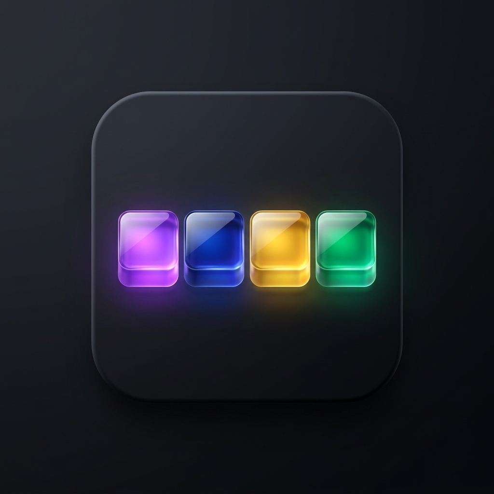

# GitGlow 🎨

  

A sleek, lightweight, and premium Chrome Extension that replaces the default, monotonous green GitHub contribution grid with a vibrant and modern color gradient.

---

## ✨ Features

- **Modern Palette**: Transforms the contribution squares into an eye-catching spectrum of Purple, Blue, Yellow, and Green.
- **Theme Compatible**: Specially optimized to look stunning in both GitHub **Light Mode** and **Dark Mode** themes.
- **Ultra-Lightweight**: Uses Manifest V3 and pure CSS injection for instantaneous, flicker-free performance with zero impact on browser memory.
- **Unified Styling**: Styles the contribution graph, the grid legend, and tooltips seamlessly.

---

## 🎨 The Color Spectrum

Your contribution grid levels will be mapped as follows (from less to more activity):

| Contribution Level | Color Code | Visual Representation |
| :--- | :--- | :--- |
| **Level 0 (No contributions)** | `Default` | Unchanged (keeps your theme background) |
| **Level 1 (Few contributions)** | `#a855f7` | 🔮 **Vibrant Purple** |
| **Level 2 (Some contributions)** | `#3b82f6` | 💎 **Royal Blue** |
| **Level 3 (Many contributions)** | `#fbbf24` | ☀️ **Warm Yellow** |
| **Level 4 (Most contributions)** | `#10b981` | 🍀 **Emerald Green** |

---

## 🚀 How to Install

Since **GitGlow** is a custom developer extension, you can load it directly into Google Chrome in just a few seconds:

1. **Download / Clone** this repository to your local machine.
2. Open **Google Chrome** and navigate to `chrome://extensions/`.
3. Enable **Developer mode** by toggling the switch in the top-right corner.
4. Click **Load unpacked** in the top-left corner.
5. Select the folder containing this project (`GithubGreen`).
6. Pin **GitGlow** to your browser toolbar to see the beautiful glassmorphic icon!
7. Navigate to any [GitHub](https://github.com) profile and watch your achievements glow!

---

